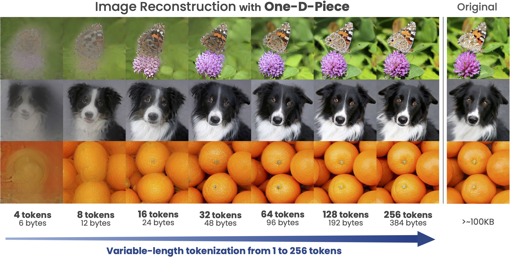

# One-D-Piece: Image Tokenizer Meets Quality-Controllable Compression

<div align="center">

[]([https://tur.ing/](https://arxiv.org/abs/2501.10064))&nbsp;&nbsp;
[](https://turingmotors.github.io/one-d-piece-tokenizer/)&nbsp;&nbsp;
[](https://huggingface.co/collections/turing-motors/one-d-piece-6785c8c5fea9f9a5104d142e)&nbsp;&nbsp;
</div>


We propose **One-D-Piece**, a novel image tokenizer supporting quality-controllable image compression.



## Usage

### Model Zoo

| Dataset  | Model | Link | FID |
| ------------- | ------------- | ------------- | ------------- |
| ImageNet  | One-D-Piece-L-256 Tokenizer | [checkpoint](https://huggingface.co/turing-motors/One-D-Piece-L-256)| 1.08 (reconstruction) |
| ImageNet  | One-D-Piece-B-256 Tokenizer | [checkpoint](https://huggingface.co/turing-motors/One-D-Piece-B-256) | 1.11 (reconstruction) |
| ImageNet  | One-D-Piece-S-256 Tokenizer | [checkpoint](https://huggingface.co/turing-motors/One-D-Piece-S-256) | 1.48 (reconstruction) |
| ImageNet  | One-D-Piece-L-256 Generator | [checkpoint](https://huggingface.co/turing-motors/MaskGIT_One-D-Piece-L-256)| 2.35 (generation) |
| ImageNet  | One-D-Piece-B-256 Generator | [checkpoint](https://huggingface.co/turing-motors/MaskGIT_One-D-Piece-B-256) | 2.70 (generation) |
| ImageNet  | One-D-Piece-S-256 Generator | [checkpoint](https://huggingface.co/turing-motors/MaskGIT_One-D-Piece-S-256) | 2.67 (generation) |

### Inference
For just runnnig tokenizer/detokenizer inference, run the following script.

```bash
python3 scripts/inference_tokenizer.py --image assets/ILSVRC2012_val_00010240.png
```

For the inference of generator model, run the following script.

```bash
python3 scripts/inference_generator.py
```

### Training

#### Preparation
For training on ImageNet Dataset, you have to prepare WebDataset files as follows. You may also need to use `huggingface-cli login` for doing this.

```bash
python3 data/convert_imagenet_to_wds.py \
    --output_dir ./imagenet_sharded
```

If you train the tokenizer, you also need pretrained tokenizer weight for stage1 training.

```bash
wget https://huggingface.co/fun-research/TiTok/resolve/main/maskgit-vqgan-imagenet-f16-256.bin
```

#### Training
We provide a Slurm batch script for training One-D-Piece models.

```bash
sbatch train_tokenizer.sh configs/training/stage1/one-d-piece_s256.yaml
```

For the training of generator model, use the following script.
```bash
sbatch train_generator.sh configs/training/generator/maskgit_one-d-piece_s256.yaml
```

### Evaluation
Evaluation runs for several steps.

First, you have to prepare reconstructed images as follows. This generates `generated/one-d-piece-s-256_len-256/images.npy` which includes all the reconstructed images for ImageNet-1K validation split.
```bash
WANDB_MODE=offline accelerate launch \
    --mixed_precision=bf16 \
    --num_machines=1 \
    --num_processes=1 \
    --machine_rank=0 \
    --main_process_ip=127.0.0.1 \
    --main_process_port=9999 \
    --same_network \
    scripts/reconstruct_tokenizer.py \
        --config configs/eval/one-d-piece_s256.yaml \
        --length=128 \
        --output_dir generated/one-d-piece-s-256_len-128
```

Second, you have to run evaluation script.

### Analysis

#### Token Contribution Analysis
For token contribution analysis, we utilized the following procedure.

```bash
python3 scripts/generate_token_contribution_data.py \
    --config configs/eval/one-d-piece_s256.yaml \
    --output_dir analysis/one-d-piece-s-256
```

After that, you can use `scripts/visualize_token_contribution.py` to generate visualized heatmaps and grids.

```bash
python3 scripts/visualize_token_contribution.py --input analysis/one-d-piece-s-256
```

#### First Token Analysis
For first token analysis, we utilized the following procedure.

First, you have to generate tokenized images with the following command.
```bash
WANDB_MODE=offline accelerate launch \
    --mixed_precision=bf16 \
    --num_machines=1 \
    --num_processes=1 \
    --machine_rank=0 \
    --main_process_ip=127.0.0.1 \
    --main_process_port=9999 \
    --same_network \
    scripts/reconstruct_tokenizer.py \
        --config configs/eval/one-d-piece_s256.yaml \
        --output_dir analysis/one-d-piece-s-256 \
        --tokens
```


After that, you can use `scripts/visualize_first_token_clustering.py` to generate first token clusters.

```bash
python3 scripts/visualize_first_token_clustering.py --data analysis/one-d-piece-s-256/tokens.npz --prefix 1208
```

## License

This project is licensed under the Apache License 2.0.  
It is based on the [bytedance/1d-tokenizer](https://github.com/bytedance/1d-tokenizer) developed by Bytedance Ltd., which is also licensed under the Apache License 2.0.  

We have built upon their work by introducing additional features and modifications tailored to our specific use cases. We acknowledge and appreciate their contribution as the foundation of our development.

## Acknowledgement

[TiTok](https://github.com/bytedance/1d-tokenizer)

[MaskGIT](https://github.com/google-research/maskgit)

[Taming-Transformers](https://github.com/CompVis/taming-transformers)

[Open-MUSE](https://github.com/huggingface/open-muse)

[MUSE-Pytorch](https://github.com/baaivision/MUSE-Pytorch)


## Cite

```
@misc{onedpiece,
      title        = {One-D-Piece: Image Tokenizer Meets Quality-Controllable Compression},
      author       = {Keita Miwa and Kento Sasaki and Hidehisa Arai and Tsubasa Takahashi and Yu Yamaguchi},
      year         = {2025},
      eprint       = {2501.10064},
      archivePrefix= {arXiv},
      primaryClass = {cs.CV},
      url          = {https://arxiv.org/abs/2501.10064},
 }
```
